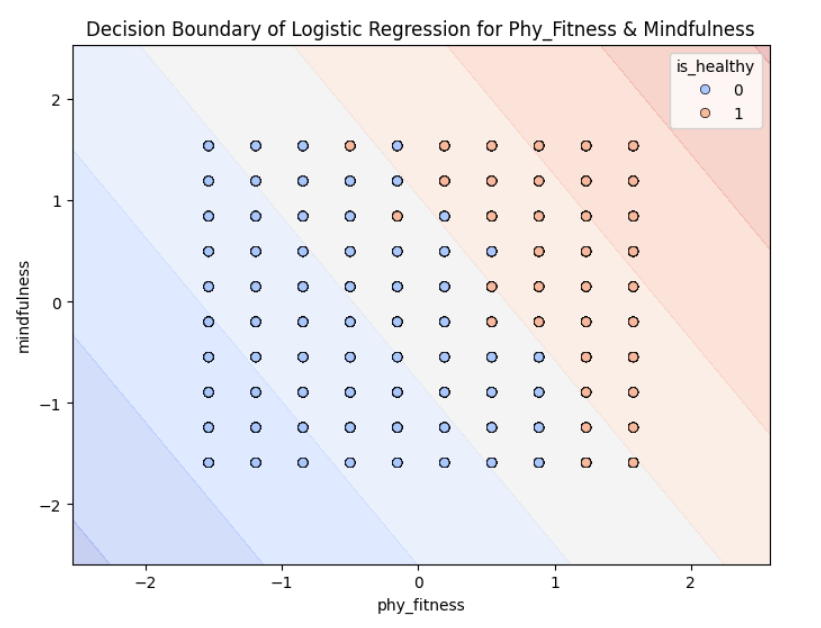

# Innoviz_VJTI_AI-ML
Round1 Submission for AI/ML

# 🏥 Health Prediction Model

This repository contains a machine learning model for predicting health status (`is_healthy`). The best model was selected based on performance evaluation.

---

## 📊 Best Model Summary  
The best-performing model is **Logistic Regression** with the following parameters:  

- **Regularization (C):** `10`  
- **Penalty:** `l2`  
- **Solver:** `liblinear`  
- **Final Accuracy:** `99.92%`  

---

## 🔥 Decision Boundary Visualization  
Below is the decision boundary visualization using the two most important features (`phy_fitness` & `mindfulness`):  

---

## 🚀 Run on Google Colab  
Click the link below to open the Colab notebook and test the model:  

---
